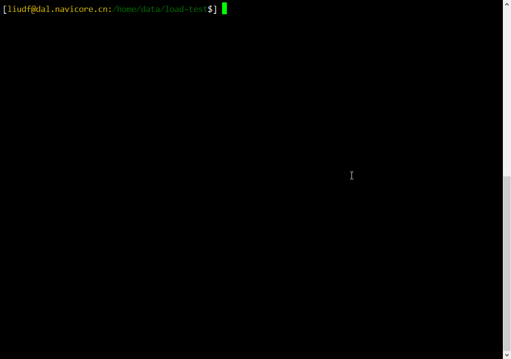

# visual-wrk

HTTP load tester. Features HTML based report(including charts), dynamic parameters, etc.



## Basic Usage

    visual-wrk -c400 -d30s http://127.0.0.1

  This runs a benchmark for 30 seconds, and keeping
  400 HTTP connections open.
  Output a log.html in report/ directory.

    export WRK_URL=http://127.0.0.1:8080
    visual-wrk -c400 -d30s -j data.json --latency

  This runs a benchmark for data.json, print detailed latency statistics.
  Output a log.html in report/ directory.

## Benchmarking Tips

  - The software is developed on the basis of WRK;

  - Reduce the delay caused by loading files;

  - Support mass random pressure test;

  - Support mixed pressure measurement with different weights;

  - Support visual presentation of test results;

  - Support integration with Jenkins HTML report;

  - Support the collection and display of server performance.


## Install

>```shell
>git clone git@github.com:NavInfoNC/visual-wrk.git
>cd visual-wrk/
>make
>sudo make install
```


## Command Line Options

    -c, --connections: Total number of HTTP connections to keep open with
                       each thread handling N = connections/threads
    -d, --duration:    duration of the test, e.g. 2s, 2m, 2h
    -i, --interval     request sampling interval
    -s, --script:      Load Lua script file
    -j, --json         load json data for script
    -H, --header:      HTTP header to add to request, e.g. "User-Agent: wrk"
        --latency:     print detailed latency statistics
        --timeout:     record a timeout if a response is not received within
                       this amount of time.

## Acknowledgements

  Visual-wrk is a secondary development project based on WRK and adds Jansson library.

  Please consult the NOTICE file for licensing details.

## More info

    [jenkins/jenkins.md](jenkins/jenkins.md)

    [docs/visual-wrk-blog.md](docs/visual-wrk-blog.md)

    [tool/json-generator/README.md](tool/json-generator/README.md)
